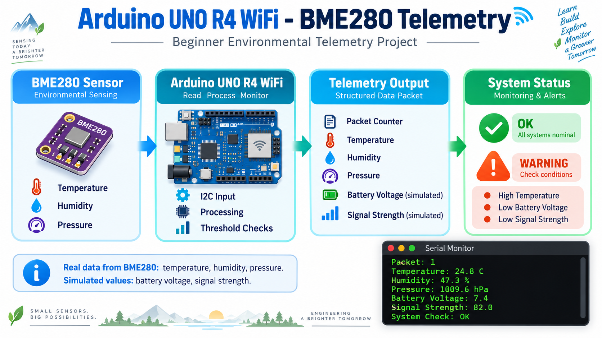

# Arduino UNO R4 WiFi - BME280 Telemetry

Beginner environmental telemetry project using the **Arduino UNO R4 WiFi** and a **BME280 sensor**.

The project reads real environmental data from the BME280 sensor and combines it with simulated telemetry values to create a simple monitoring and warning system.



---

## Project Overview

The system currently monitors:

- Temperature
- Humidity
- Atmospheric pressure
- Battery voltage *(simulated)*
- Signal strength *(simulated)*

The Arduino evaluates the telemetry values against predefined thresholds and reports the overall system status through the **Serial Monitor**.

---

## Hardware

- Arduino UNO R4 WiFi
- BME280 sensor
- Jumper wires
- USB-C data cable

---

## BME280 Connection

| BME280 | Arduino UNO R4 WiFi |
|---|---|
| VCC | 3.3V |
| GND | GND |
| SDA | SDA |
| SCL | SCL |

The BME280 used in this project is detected at:

```text
I2C address: 0x77